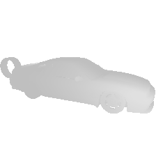

# ShapenetRender_more_variation

## A new shapenet rendering 2D image dataset that also contains deph map, normal map and albedo map.

Please cite our paper[DISN: Deep Implicit Surface Network for High-quality Single-view 3D Reconstruction (NeurIPS 2019)](https://arxiv.org/abs/1905.10711) if you plan to download the rendered images or use our code to render by yourself.

``` 
@inProceedings{xu2019disn,
  title={DISN: Deep Implicit Surface Network for High-quality Single-view 3D Reconstruction},
  author={Xu, Qiangeng and Wang, Weiyue and Ceylan, Duygu and Mech, Radomir and Neumann, Ulrich},
  booktitle={NeurIPS},
  year={2019}
}
``` 
Code contact: [Qiangeng Xu*](https://xharlie.github.io/) and [Weiyue Wang*](https://weiyuewang.github.io/)

Also please cite [Shapenet's original paper](https://arxiv.org/abs/1512.03012) as well.

### Dataset Intro:
 The categories included are: 
    ```cat_ids = {
        "watercraft": "04530566",
        "rifle": "04090263",
        "display": "03211117",
        "lamp": "03636649",
        "speaker": "03691459",
        "cabinet": "02933112",
        "chair": "03001627",
        "bench": "02828884",
        "car": "02958343",
        "airplane": "02691156",
        "sofa": "04256520",
        "table": "04379243",
        "phone": "04401088"
        }
    ```
    
Our rendering is based on the convention of [3DR2N2](https://arxiv.org/abs/1604.00449)'s 2d image rendering.
 
 * #### Our script support both shapenet v1 and v2, for v2 you need to change render_blender.py's random range since some model always get out of the field of view. The tar files we provide is rendered on v1.
 * #### Each model object has 36 easy views and 36 hard views.(3DR2N2 has 24 easy views)
 * #### Each view of each model object, we have albedo, depth, normal and RGB images.(3DR2N2 has only RGB images)
 * #### different from 3DR2N2, our resolution is 224 * 224 instead of 137 * 137
 * #### All the object is absolutely inside the field of view.
 * #### Camera is looking at origin, but in hard folder, we randomly shift the center of the model at (x_rand,y_rand,z_rand)
 * #### We set camera Pitch to 0 degree since in most case in real world, the floor is flat.(We assume camera to the origin is along Z axis, the rotation along Z is 0 degree)
                                           
| albedo  | RGB  |  Depth | normal | 
|---|---|---|---|
|    |   |   |   |
 
In each folder, there is a meta file: rendering_metadata.txt:
each line represent a parameter:

| camera Yaw | camera Roll |  camera Pitch | distance ratio (0 to 1) | Focal length in mm | Sensor size in mm | max real distance | x_rand | y_rand | z_rand |
|---|---|---|---|---|---|---|---|---|---|
|74.77100786318874|37.07793266268725|0|0.6451202137421064|35|32|1.75|-0.1529439091682434|-0.13056571781635284|0.0746786817908287| 

### Dataset download:
[image.tar](https://drive.google.com/file/d/1gwRviPb18vANDECAqeUqLBCvBTnfq7fo/view?usp=sharing)

[albedo.tar](https://drive.google.com/file/d/1sA21ywWjve2VXxqARhiWa109cq_1Ntv4/view?usp=sharing)

[depth.tar](https://drive.google.com/file/d/1IA9gYqK0K7oVXdRPQDdGitLArpexdfSI/view?usp=sharing)

[normal.tar](https://drive.google.com/file/d/1S0lOG3Id_e2FwXwMf4AMp7-xBfVsVk7Z/view?usp=sharing)

### Run the script by yourself :
```
  install blender 2.79 and go to its python3.5m to install pip3, then install numpy and opencv
  
  python -u render_batch --model_root_dir {model root dir} --render_root_dir {where you store images} --filelist_dir {which models you want to render} --blender_location {you} --num_thread {10} --shapenetversion {support v1, v2} --debug {False}
```

### Transformation matrix calculation:
Please refer to cam_read.py
